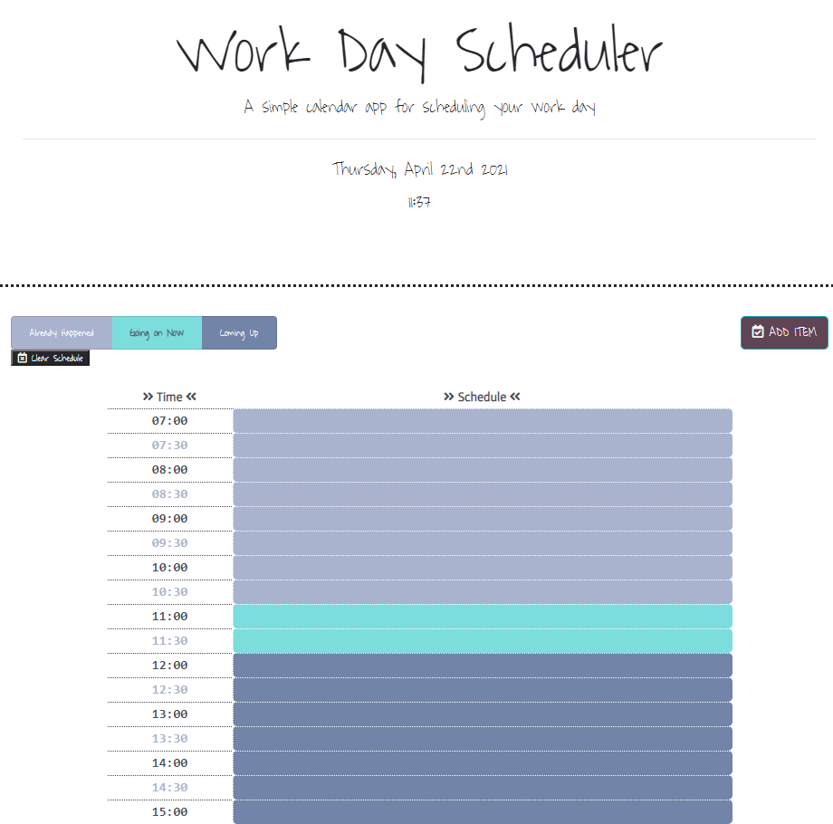
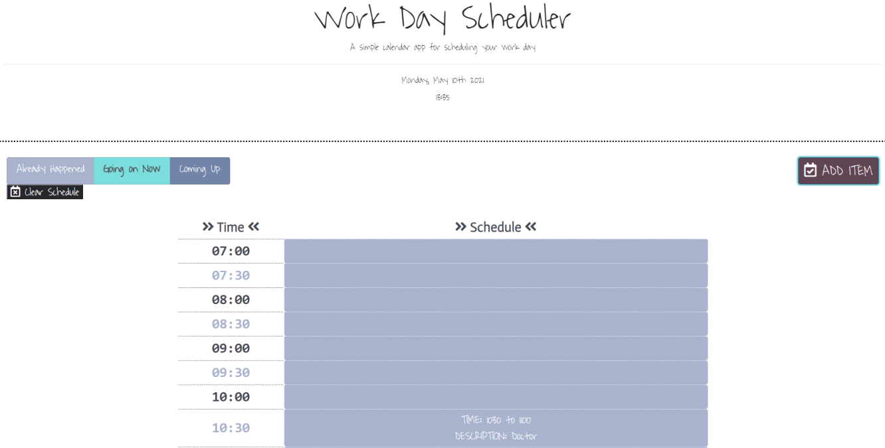

# DailyPlanner

## Description
This Work Day Scheduler is designed to help you organize your day! Add in scheduled events to populate your schedule. The time blocks are color coded to represent events that have already happened, what is currently happening, and what you have left in the future.

In this project, bootstrap and jQuery were used in order to create a table element that data will populate via a modal. I learned how to iterate through for loops to compare two sets of data, populate the correct time slot based on user input, and utilize local storage to set and get items into an array from the user input.

## Usage
Click on the ADD EVENT button. A modal will appear, with a line for text to input the event description for the schedule, and drop down menus for the start time and end time for the event. Click close at anytime to cancel the modal, or click Add New Event to save the item and render it to your schedule.

Application Link: https://aanolan51.github.io/DailyPlanner/

## Credits
1. https://getbootstrap.com/docs/4.0/layout/grid/
2. https://www.freecodecamp.org/news/the-best-jquery-examples/
3. https://zetcode.com/javascript/momentjs/
4. https://www.codeproject.com/Questions/1385566/How-to-add-new-line-using-jquery
5. https://www.youtube.com/watch?v=DFhmNLKwwGw&list=PLDlWc9AfQBfZIkdVaOQXi1tizJeNJipEx&index=9
6. https://www.tutorialrepublic.com/faq/how-to-refresh-a-page-with-jquery.php#:~:text=Answer%3A%20Use%20the%20JavaScript%20location,be%20reloaded%20from%20the%20server.